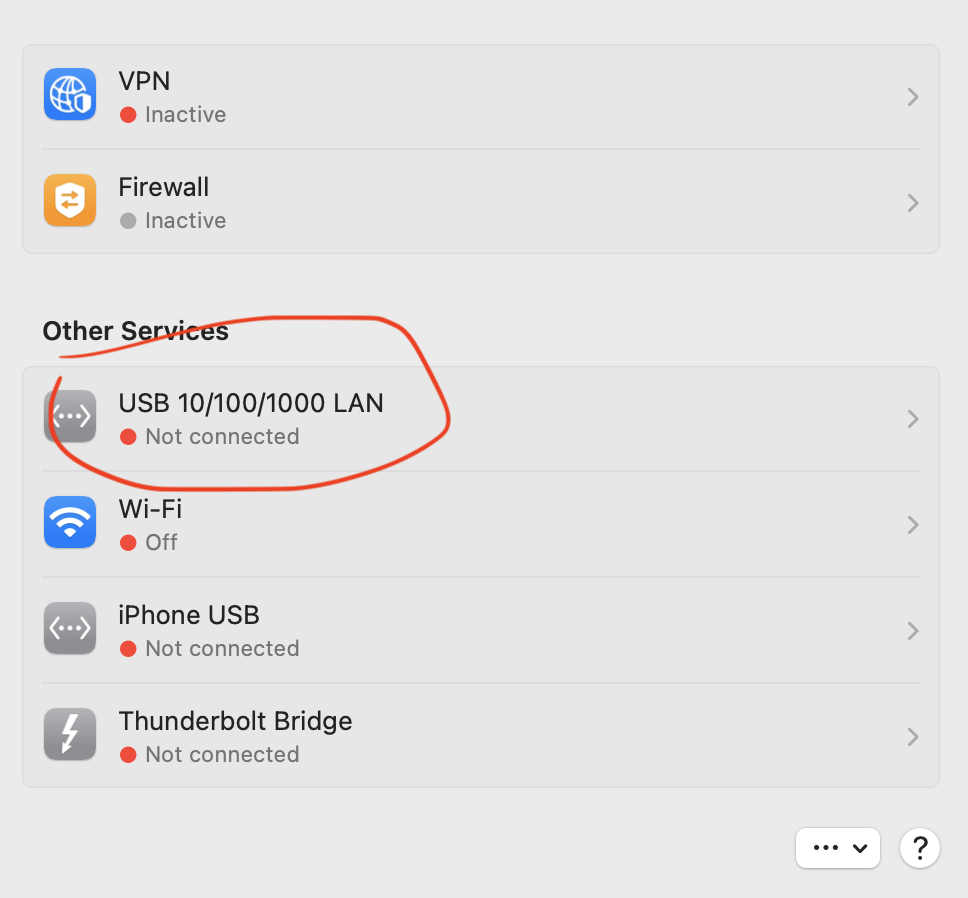
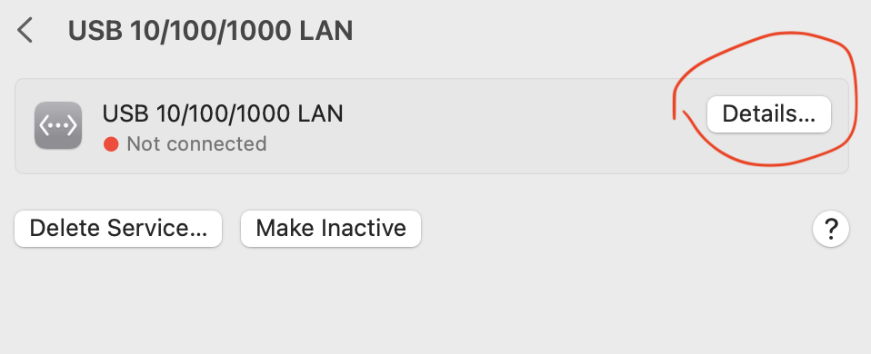
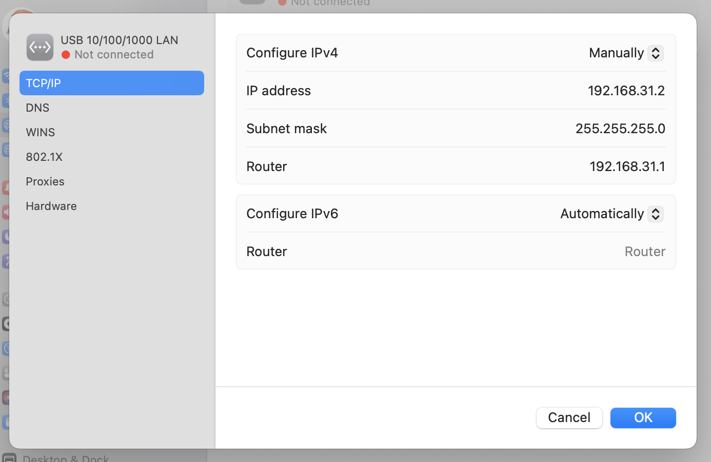

A short preamble. If you don't want to read how i've bricked my router go to the next chapter "Debricking".

I've bought a Xiaomi 4c router on my trip so I can make it work in hotspot mode. Router connects to hotel wifi and then I connect to its private network, so all my devices are not reachable from the hotel network. Even though I saw that the router supports such mode in reality there was none. So I decided to install OpenWrt. Long story short I've installed it and made it work. My verdict is that though theoretically OpenWrt works practically, it works unstable. After some time the router just stops to respond, either via ssh, web front, wifi connection, etc... When my hotel days were over I decided to restore the original MiWifi firmware. I downloaded one on official website: https://miuirom.org/miwifi/mi-router-4c

By the time of this post latest official international version is _3.0.23_ (Release date 2020-10-25). This is what I've chosen to go with. Full name of the firmware is `miwifi_r4cm_firmware_c6fa8_3.0.23_INT.bin`.

So I've downloaded it and put into OpenWrt as described in OpenWrt documentation - https://openwrt.org/toh/xiaomi/xiaomi_mi_router_4c#openwrt_back_to_stock

After some time I saw "IO Error" or something like this and my router light became flashing orange. Time passed but the light didn't change. I've bricked my router. Ok, so this is where the article should start.

# Debricking

First what should we have:

- Ethernet cable connection to Mac. I have my ethernet cable connected through [6-in-1 rock adapter](https://www.troyestore.com/rock-multi-fonksiyon-6-in-1-type-c-donusturucu_210347)
- Firmware. Can be downloaded at the official page https://miuirom.org/miwifi/mi-router-4c. By the time of this post latest international firmware is 3.0.23 (`miwifi_r4cm_firmware_c6fa8_3.0.23_INT.bin`)
- [DnsMasq](https://thekelleys.org.uk/dnsmasq/doc.html) to be installed, as this is what we will use as a tftp server. It can be easily installed with [Homebrew](https://brew.sh/) with `brew install dnsmasq` command in the terminal.
- Toothpick or something to push the reset button.

## Theory

To restore we should connect to the router with manual ip setup, put the router to boot mode, spin tftp router in pxe mode and make the router download our firmware.

## Practice

To connect to the router we put one end of the cable to any LAN port of the router. The other end goes to mac.

Then we go to network settings and disable WI-FI, so it won't conflict with our local one we will make between router and mac. Then we go to settings of the ethernet connection.



Then we go to details



And then we change mode to manual. Xiaomi 4c by default has its default ip to be `192.168.31.1`. I've tried many other and that is what I've succeeded with, also this IP is described as the main one on official page (["What IP address does Mi Router 4C have?"](https://miuirom.org/miwifi/mi-router-4c)). So we make the router's address to be `192.168.31.1` and the address of the mac to be `192.168.31.2`. Subnet mask we define as `255.255.255.0`



Then we must put our router to restore mode. To do this eject power plug, then push the reset button with a toothpick and hold it. Then insert the power plug and wait for ~8-10 seconds until the router starts to blink with orange light frequently. To make another attempt just repeat steps above until you succeed.

In network settings you should see that your Ethernet connection should be `connected`.

Then I've created a directory where I put my firmware. Let it be `/Users/user/Desktop/4crestore`:

```bash
mkdir /Users/user/Desktop/4crestore
cp ./Downloads/miwifi_r4cm_firmware_c6fa8_3.0.23_INT.bin /Users/user/Desktop/4crestore/miwifi.bin
chmod 766 /Users/user/Desktop/4crestore/miwifi.bin
cd /Users/user/Desktop/4crestore
```

Then we should find the interface id of our Ethernet connection. It can be done with the `ifconfig` command in the terminal. Find some interface that mentions `192.168.31.2` address. Its name should be something like `en1` or `en2`. In my case it was `en6`

Now we should spin the tftp server in pxe mode. There are a lot of tutorials for Windows where people open TinyPxe server. This is an analog of what we should do except we would use `dnsmasq`.

_\*Optional_ Do not forget to stop `dnsmasq` if you use it as `homebrew` service — `sudo brew services stop dnsmasq` command in the terminal.

Then we start server with following terminal command:

```bash
sudo /usr/local/sbin/dnsmasq \
-i en6 \
-p 0 \
-d -z \
--enable-tftp --tftp-root /Users/user/Desktop/4crestore --tftp-unique-root --tftp-no-fail \
--dhcp-range 192.168.31.2,192.168.31.10,255.255.255.0,12h
```

So, let decipher command arguments:

- `-i en6` — name of interface we bind our tftp server, se `ifconfig` note above.
- `-p 0` - we set port to 0. [This disables DNS function and leaves only DHCP and TFTP](https://linux.die.net/man/8/dnsmasq)
- `-d` - we put server into debug mode for the convenience. It doesn't go to daemon mode and we can see logs straight in terminal.
- `-z` - we bind server only to interfaces we declared.
- `--enable-tftp` - we enable tftp-server.
- `--tftp-root /Users/user/Desktop/4crestore` - we set root of our server to directory with firmware. It is important that directory has no other files.
- `--tftp-unique-root --tftp-no-fail` - some other flags I am not sure what they do but without them there is no luck.
- `--dhcp-range 192.168.31.2,192.168.31.10,255.255.255.0,12h` - we set our IP's range, subnet mask and lease time. Range should be set because router takes firmware from address that is not router's address (`192.168.31.1`) but the first available address in range — `192.168.31.3`

So after we spinned our server we should see this:

```log
dnsmasq: started, version 2.89 DNS disabled
dnsmasq: compile time options: IPv6 GNU-getopt no-DBus no-UBus no-i18n no-IDN DHCP DHCPv6 no-Lua TFTP no-conntrack no-ipset no-nftset auth no-cryptohash no-DNSSEC loop-detect no-inotify dumpfile
dnsmasq-dhcp: DHCP, IP range 192.168.31.2 -- 192.168.31.10, lease time 12h
dnsmasq-tftp: TFTP root is /Users/user/Desktop/4crestore
```

If we made everything correctly we then should see

```log
dnsmasq-dhcp: DHCPDISCOVER(en6) 00:00:aa:bb:cc:dd
dnsmasq-dhcp: DHCPOFFER(en6) 192.168.31.3 00:00:aa:bb:cc:dd
dnsmasq-dhcp: DHCPREQUEST(en6) 192.168.31.3 00:00:aa:bb:cc:dd
dnsmasq-dhcp: DHCPACK(en6) 192.168.31.3 00:00:aa:bb:cc:dd
dnsmasq-tftp: sent /Users/user/Desktop/4crestore/miwifi.bin to 192.168.31.3
```

If you see lines above then it succeeded 🎉. Router have downloaded our firmware.

After some time router light will change from orange to blinking blue. This is where router starts to boot. Then from blinking blue to non-blinking blue. This is where it should be ready. Try access [http://192.168.31.1](http://192.168.31.1) In browser while you still connected manually with ethernet. You should see MiWifi setup page.
