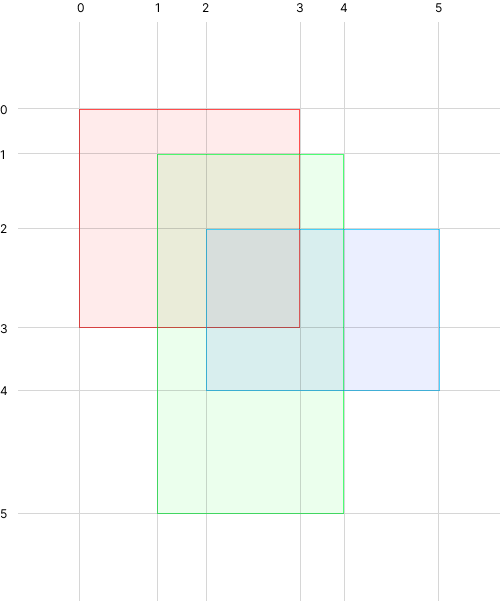

Consider we have a set of multiple overlapping rectangles and we want to reduce it so in the result we have a set that occupies the same area but rectangles inside do not overlap with each other.

First we have the input:

Results may vary. We can go many ways:

---

---

---

So how do we go?

# Algorithm

First we do is creating grid from the vertices of each rectangle:

By doing so we now have coordinate space. Let's say first will be y coordinate, and then x coordinate. `(0.0)`, `(1,0)`, `(1.1)` etc...

Then let's make some `Set` where we will write down visited cells, because our algorithm will include subloops.

Also we will make an `Array` where we will put our result. Each item in the array will consist of two coordinates: top left, and bottom right corners.

## Find a rectangle

So let's start by iterating on Y (top to bottom) and then x (left to right) coordinates. Our goal is to find first rectangle start position and height. In out case we got start position at `(0,0)` and end at `(3,0)`. So our rectangle has height equal to `3`. Okay, so next step is we make sub loop by iterating from `y = 0` up to `y = 3` (`3` is not included). On x direction we iterate from start position `0` up to the last grid x coordinate `5`. Our goal here is to find the width of the rectangle. We iterate by column and remember x coordinate where column height equals our rectangle's height. If we see that there cell is not occupied we break the loop and take last remembered value.

So we go `(0,0)`, `(1,0)`, `(2,0)`, `(1,0)`, `(1,1)`, `(1,2)`, `(2,0)`, `(2,1)`, `(2,2)`. `(3,0)` is empty, so we break the loop. Resulting width we got is `3`. We got our first rectangle. We should put it into our results array. We put `[(0,0), (2.2)]`. Also we should put every cell of the rectangle into the set of visited cells.

And now we continue our main loop. If the cell was already visited then we just skip it. We go:

- `(1,0)` visited — skip
- `(2,0)` visited — skip
- `(3,0)` empty — skip and put into visited cells set
- `(4,0)` empty — skip and put into visited cells set

- `(0,1)` visited — skip
- `(0,2)` visited — skip
- `(0,3)` new rectangle start. We repeat a process in [Find a rectangle](#find-a-rectangle) step.

## Result

So that is basically it. We get following picture when we end main loop iteration:

And that's it! By repeating steps above we can find a new set of non-overlapping rectangles which occupy the same area as an input.

